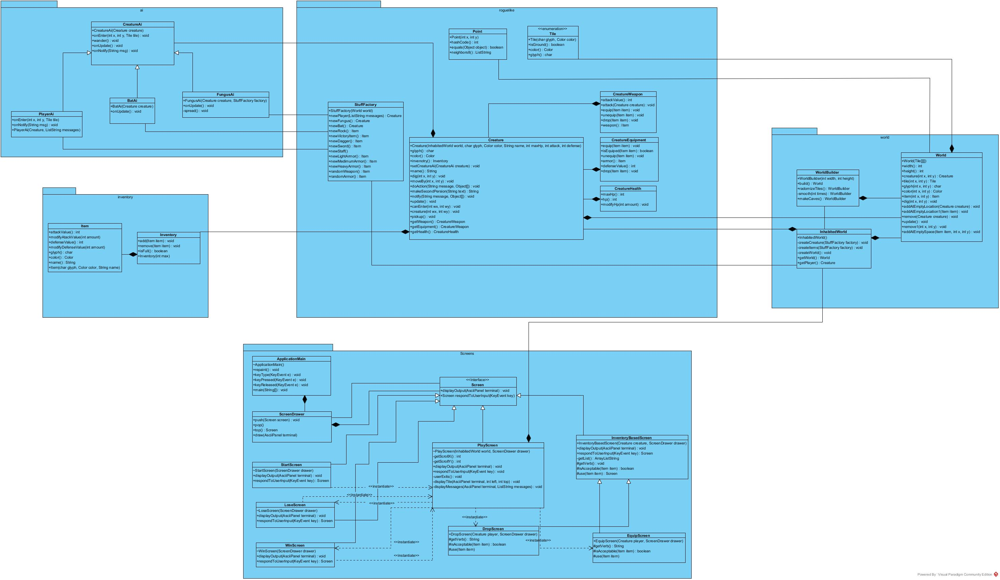

# Roguelike
Смысл игра заключвается в том что бы найти '*' - teddy bear. И не умереть.  

## Общие сведения о системе
### Игровые объекты:  
#### Враги:  
@ - player  
f - fungus. Безобидные существа. Могут заполнять всю карту из-за чего замедлять передвижение игрока по карте  
b - bat. Имеют лучшую защиту чем у fungus. Могут атаковать  
  
#### Снаряжение:  
] - может быть tunic/chainmail/platemail  
		tunic - дает защиту 2  
		chainmail - дает защиту 4  
		platemail - дает защиту 6  
  
#### Оружие:  
) - может быть dagger/sword/staff  
	dagger - позволяет наносить урон равный 5  
	sword - позволяет наносить урон равный 10  
	staff - позволяет наносить урон 5 и дает защиту 3  
  
#### Предметы:  
\* - teddy bear. Является смыслом игры. После его получения игрок может закончить игру и стать победителем.  
  
#### Местность:  
, - rock. Никакой пользы не приносят.  
  
### Управление:  
Enter - позволяет прнимать решения  
Esc - выход из игры  
Left, H - перемещение влево  
Right, L - перемещение вправо  
Up, K - перемещение вверх  
Down, J - перемещение вниз  
Y - перемещение влево-вниз  
U - перемещение вправо-вниз  
B - перемещение влево-вверх  
N - перемещение вправо-вверх  
D - Экран для удаления предметов  
W - Экран для выбора снаряжения  
G, ',' - подобрать предмет  

### Победа или поражение:  
Для победы необходимо найти и подобрать '*'. После чего нажать Esc. Если не нажать Esc, то игру можно продолжать. Если Вас убьют или Вы захотите нажать Esc без '*', то Вас убьют 

## Роли и случаи использования
Игра предназанчена для детей 8+. Является развлекательным контентом. Игрок управляет персонажем ролевой игры. Перемещение по карте осуществляется с использование клавиш стрелок. Для того что бы ударить противника необходим пойти в его сторону. Если игрок хочет поднять какой-то прдемет необходимо нажать G или ','. Изменение инвенторя происходит на специальных экранах, переход на которые осуществляется с помощью клавиш W,D. На этих экранах выбор предметов осуществляется с помощью клави a-z. Для успешного завершения игры необходимо найти '*' - teddy bear и нажать клавишу Esc, которая позволяет выйти из игры

## Композиция и логическая структура
  
  
## Взаимодействия и состояние
### Диаграмма последовательностей
  
  
### Диаграмма конечных автоматов

